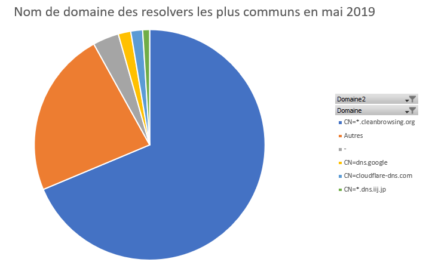

# Analyse des données fournies par les auteurs et comparaison avec les résultats présentés dans l'article

### L'objectif est de vérifier les résultats présentés dans l'article, et entre autre ceux présentés dans le tableau 2 (le nombre de resolvers doT par pays). j'ai donc analysé avec Exel 3 jeux de données proposés: celui du 01/02/2019, celui du 01/05/2019 et celui du 01/07/2020. Pour ces trois jeux de données, j'ai évalué le nombre de resolvers doT par pays, la proportion par pays des resolveurs qui contenaient un certificat ssl 'ok' et finalement quels était les noms de domaines qui revenaient le plus (via un tableur + un graphe pour chaque thématique). 

\
Lien vers les jeux de données et le code source des auteurs de l'article : https://dnsencryption.info/imc19-doe.html

Ces jeux de données correspondent aux résultats des @IP du monde qui répondent aux requêtes DoT.
\
Remarque: Vous trouverez ce jeux de données ainsi que leur analyses dans les fichiers au format xlsx (Exel) de ce répertoire.

Autre remarque: les jeux de données ne contiennent que des réponses aux requêtes DoT, nous nous concentrerons donc uniquement sur ce protocole pour les analyses et les expériences.

\
**Préambule**: que contient ces jeux de données? Comment sont ils organisés?  

Ces jeux de données sont organisés dans des fichiers définis par la date du test auquel ils ont été effectué. Ils se présentent comme suit:

\
Chaque colonne peut s'identifier comment suit (avec Domaine pour le nom de domaine, et certificat valide pour la validité du certificat ssl, dont le rôle est expliqué dans le fichier synthèse_article.md):

Les fichiers dataset sont téléchargés enregistrés en texte document puis ouvert avec exel. Puis j'ai fait des observations des diverses résultats en réalisant des tableaux croisés dynamiques puis des graphes croisés dynamiques (outils Exels, je vous invite à aller consulter mes fichiers qui sont joints dans ce dossier).

Pour chaque jeu de données (j'en ai analysé 3), 4 évaluations ont été faites:

- 1) le nombre de résolveurs répondant aux DoT queries dans le monde
- 2) le nombre de resolveurs en question que possède chaque pays
- 3) la proportion de certificat ssl 'ok'
- 4) le nombre de résolveurs pour chaque Nom de Domaine (Common Name)

### 1) le nombre de résolveurs répondant aux DoT queries dans le monde

\
**Dataset du 01/02/2019** : 1198

**Dataset du 01/05/2019** : 2053

**Dataset du 01/07/2020** : 7062

\
**Observations / Remarques / Conclusion**

Nous trouvons quelques milliers de résolveurs qui répondent au DoT D'abord, les résultats de 2019 collent avec ceux annoncé dans l'article. Effectivement, à la fin de la page 5 il est écrit "As shown in Figure 3, **over 1.5K open DoT resolvers are discovered** in each scan, significantly more than the public resolver lists".

Par ailleurs, nous constatons l'augmentation du nombre avec le temps, notament entre l'année 2019 et 2020, ce qui est encore un fois conforme avec ce que propose l'article.

### 2) le nombre de resolveurs en question que possède chaque pays

\
**Dataset du 01/02/2019**

- 48 pays dans le monde contiennent au moins un résolveur de DoT.

\
**Dataset du 01/05/2019**

- 55 pays dans le monde contiennent au moins un résolveur de DoT.

\
**Comparaison avec le tableau**

Voici le tableau que l'on peut trouver dans l'article, page 5. En analysant avec Exel les datasets concernés par le tableau (février et mai 2019) je trouve : 

 

***Top 15 des pays avec le plus de résolveurs DoT en février 2019***

***Top 15 des pays avec le plus de résolveurs DoT en mai 2019***

En comparant, on retrouve globalement les mêmes valeurs, c'est donc cohérent.

\
**Dataset du 01/07/2020**

- 52 pays dans le monde contiennent au moins un résolveur de DoT.

Comme pour les deux datasets précédents, voici le top 15 des pays contenant le plus de résolveur DoT

\
On remarque l'absence de l'Irelande dans ce nouveau top, alors qu'il était le grand leader en 2019 sur les différents datasets étudiés. Apart ce résultat, on retrouve les mêmes pays que précédement, même si le classement est un peu modifié.

### 3) la proportion de certificat ssl 'ok'

On rappelle que la défition de ce qu'est un certificat SSL ainsi que les raisons pour lesquelles ce dernier pourrait être invalide sont données dans le document synthèse_article.md.

\
**Dataset du 01/02/2019**

- Proportion moyenne des certificats ssl valides (j'ai comptabilisé les 'ok'): 91%

Et les résultats de cette proportion par pays est représentée sur le graphe qui suit: (les pays sont ordonnées de manière décroissantes par rapport au nombre de résolveurs DoT qu'ils possèdent)

\
**Dataset du 01/05/2019**

- Proportion moyenne des certificats ssl valides: 91%

Et les résultats de cette proportion par pays est représentée sur le graphe qui suit: (les pays sont ordonnées de manière décroissantes par rapport au nombre de résolveurs DoT qu'ils possèdent)

\
**Dataset du 01/07/2020**

- Proportion moyenne des certificats ssl valides: 77,4%

Et les résultats de cette proportion par pays est représentée sur le graphe qui suit: (les pays sont ordonnées de manière décroissantes par rapport au nombre de résolveurs DoT qu'ils possèdent)

\
**Observations / Remarques / Conclusion**

Dans un premier temps, on peut relever que par exemple, le Brésil (BR) compte parmi les top pays possédant le plus de résolveurs DoT avec 22 résolveurs en février 2019 mais plus de 85% de certificats invalides. Le taux de certificats invalides tend à baisser au cours du temps mais reste particulièrement élévé.

En remarques plus globales, on voit que le taux de certificat valide baisse beaucoup pour le jeux de données de 2020 et on peut se demander pourquoi. Cela s'explique par le fait que les certificats ssl sont beaucoup plus auto-signés. Un certificat auto-signé peut être valide mais ce n'est pas forcément le cas; pour réaliser mes analyses, j'ai considéré que tous les certificats auto-signés étaient forcément invalides alors que ce n'est pas forcément le cas.

D'autre part, il a été annoncé 25% de certificats invalides dans l'article de référence. Or, après nos résultats présentés ci dessus, nous serion splus à 9% pour les jeux de données parus avant sortie de l'article. Nous pouvons expliquer ces différences avec les résultats de l'article parce que j'ai considéré dans mon analyse que tous les certificats auto-signés étaient forcément invalides. 

### 4) le nombre de résolveurs pour chaque Nom de Domaine (Common Name)

\
**Dataset du 01/02/2019**

\
- 241 Noms de Domaine différents

On filtre les résultats pour rassembler tous les petits acteurs (qui représentent 1% ou moins individuellement) dans une catégorie "Autres".

Cleanbrowsing : 40%

Autres (<14 itérations, représentent chacun 1% ou moins individuellement) : 32%

Pas de CN : 23%

Cloudflare : 3%

Dns.iij.jp : 2%

\ 
La part des petits résolveurs rassemblés dans la catégorie "Autre" représente donc quand même 1/3 des Noms de Domaines. Autre résultat intéréssant, presque 1/4 des adresses IP ne sont pas associé à un nom de domaine (catégorie "Pas de CN").

\
**Dataset du 01/05/2019**

\
- 365 Noms de Domaine différents

On filtre les résultats pour rassembler tous les petits acteurs (qui représentent 1% ou moins individuellement) dans une catégorie "Autres".

Cleanbrowsing : 40%

Autres (<14 itérations, représentent chacun 1% ou moins individuellement) : 32%

Pas de CN : 23%

Cloudflare : 3%

Dns.iij.jp : 2%

\
**Dataset du 01/07/2020**

\
- 2110 Noms de Domaine différents

On filtre les résultats pour rassembler tous les petits acteurs (qui représentent 1% ou moins individuellement) dans une catégorie "Autres".

Cleanbrowsing : 40%

Autres (<14 itérations, représentent chacun 1% ou moins individuellement) : 32%

Pas de CN : 23%

Cloudflare : 3%

Dns.iij.jp : 2%

\
**Observations / Remarques / Conclusion**

A la page 6 de l'article, nous trouvons l'histogramme suivant, représentant les résolvers DoT les plus communs et leur évolution dans le temps.

Nous, ce que nous avons évalué 

